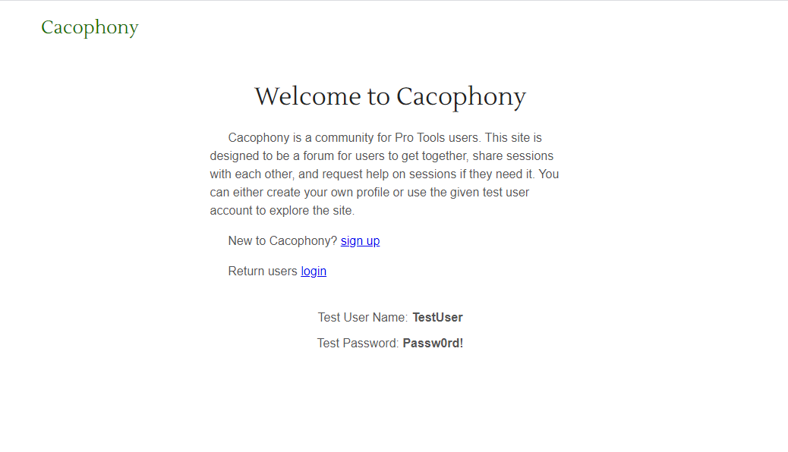

# Cacophony

## What is Cacophony?!?!

Cacophony is a posting board for Pro Tools users who are looking to meet other users. A user has the ability to create an account with us and then login to their new account. Once logged in users are able to make posts referring to a particular project the are working on. Users are then able to comment on any of the posts that either they or other users have made.

**Live Site:** [https://cacophony.now.sh](https://cacophony.now.sh)  
**API Repo:** [https://github.com/stephenschab/cacophony-server](https://github.com/stephenschab/cacophony-server)

**Demo Credentials**

  User Name: TestUser  
  Password: Passw0rd!

## What Stack?

  **Front-End:** ReactJS, CSS  
  **Back-End:** NodeJS, ExpressJS, KnexJS, PostgerSQL

## Available Features

  * Ability to create and login to your own user account.

  * Users are able to create a post.

  * Any user is able to comment on any post.

## Coming Features

  * Soon users will be able to delete their own posts once they consider the posting fulfilled.

  * Users will have a Profile view that will show them only their posts.

  * Private messaging system for users to conact each other.

  * Allow users to attach an audio file to their post.

  * Users will be able to filter posts by genre.

## Contact

[LinkedIn](https://www.linkedin.com/in/stephen-schab/)

Email Me: [sschab689@gmail.com](mailto://sschab689@gmail.com)
